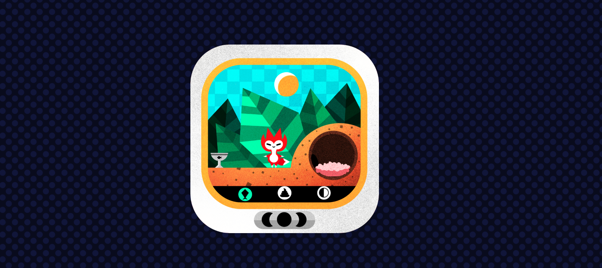

# Tamagotchi

## Introduction

This is a custom version of a Tamagotchi, the handheld virtual pet of the 90's, built following Brian Holt's [fox game workshop](https://frontendmasters.com/courses/front-end-game/) in [Frontend Masters](https://frontendmasters.com/).

The project is developed with Javascript vanilla in a first instance and the goal of the project is to refactor the code with others frameworks or languages.

## Technologies

I decided to refactor the project with React but avoiding to use create-react-app and set up a project from scratch with Webpack, SCSS modules, Redux and Typescript.

[Here](https://custom-tamagotchi.netlify.app/) is the deployed version of the project.

[Here](https://github.com/diana-moreno/tamagotchi-vanilla) you can find the source code of my version of the project with Javascript vanillla.

## What I learned

- To set up a project from scratch with Webpack.
- Add SCSS Modules to Webpack.
- Better understanding of Javascript closures with requestAnimationFrame function.
- Refactor from JS vanilla to React.
- Advanced animations with sprites and steps.
